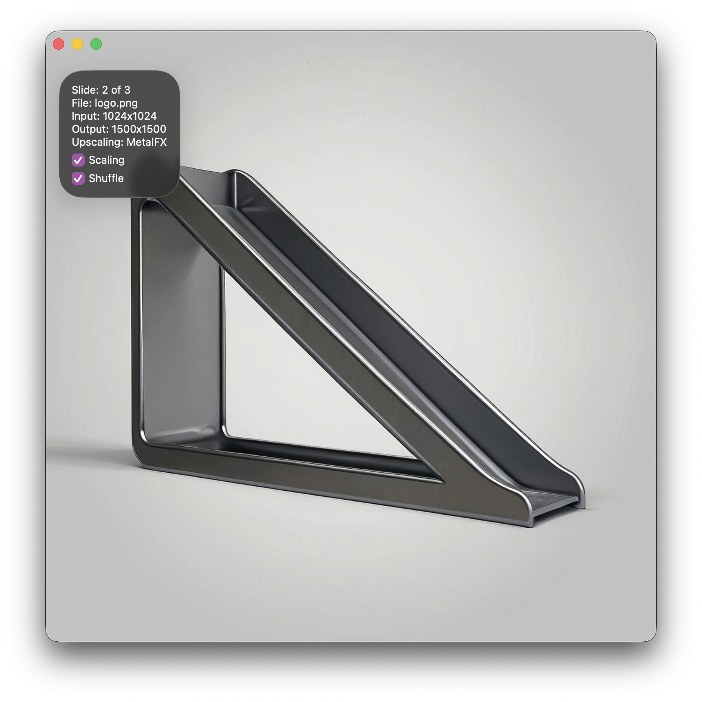

# MetalSlide
MetalSlide is a minimalist slideshow app for MacOS that uses Metal 4 and MetalFX for high quality viewing of images.

## Features
- Displays photos from a folder of your choice in shuffled order.
- Asynchronous Metal 4 pipeline for fast processing and native rendering without any OS scaling. 
- MetalFX upscaling, Lanczos-3 downscaling.
- Can delete photos from within the slideshow.

## Usage
- Start the app.
- Select your folder.
- Right Arrow / Spacebar = Next
- Left Arrow = Previous
- Delete = Trash Image
- i = View Info
- Esc = Exit
